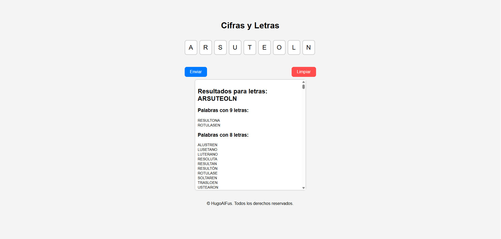

# 🎲 Cifras y Letras

   

[](https://hugoalfus.github.io/Cifras-Y-Letras/)

> Pequeña aplicación web estática para practicar manipulación del DOM en JavaScript: introduce letras en inputs y valida/muestra el resultado.

---

## 📖 Descripción

Proyecto **demo y educativo** que permite introducir letras (un carácter por input) y validar resultados con **JavaScript puro**.

Ideal para:

* 🧩 Aprender **manipulación del DOM**
* 🌐 Crear un **demo público en GitHub Pages**
* 📚 Ejemplo de **estructura clara y buenas prácticas**

---

## 📂 Estructura del proyecto

```
index.html
assets/
 ├─ css/
 │   └─ style.css        # Estilos de la página
 ├─ js/
 │   └─ script.js        # Lógica del frontend
 └─ resources/
     └─ palabras.txt     # Lista de palabras para validar
README.md
```

---

## 🔑 Archivos importantes

| Archivo                         | Descripción                                                     |
| ------------------------------- | --------------------------------------------------------------- |
| `index.html`                    | Página principal con inputs, botones y contenedor de resultados |
| `assets/css/style.css`          | Estilos de la página                                            |
| `assets/js/script.js`           | Captura de eventos, validación y renderizado                    |
| `assets/resources/palabras.txt` | Lista de palabras que puede usar la aplicación                  |

---

## 🌐 Demo público

Puedes exponer este proyecto en **GitHub Pages** para que cualquiera lo pruebe directamente desde el navegador.



[🔗 Ver Demo](https://hugoalfus.github.io/Cifras-Y-Letras/)

---

## 🛠 Requisitos

* Navegador moderno: Chrome, Edge, Firefox, Safari 🌟
* No necesita servidor ni dependencias, pero un servidor estático evita problemas con rutas relativas

---

## 🚀 Servir localmente

### 🐍 Python 3 (recomendado)

```powershell
python -m http.server 8000
```

Accede a [http://localhost:8000](http://localhost:8000)

### 🟢 Node.js con http-server

```powershell
npm install -g http-server
http-server -p 8080
```

Accede a [http://localhost:8080](http://localhost:8080)

### ⚡ PowerShell/.NET

```powershell
dotnet tool install --global dotnet-serve -v q
dotnet-serve -p 5000
```

Accede a [http://localhost:5000](http://localhost:5000)

---

## 📝 Uso

1. Abre la página (`index.html` o URL local).
2. Introduce **una letra por input** ✏️
3. Haz clic en **"Enviar"** ✅ para validar y mostrar el resultado
4. Haz clic en **"Limpiar"** 🧹 para vaciar los inputs

---

## 🤝 Contribuir

1. Haz **fork** del repositorio 🍴
2. Crea una rama para tu cambio:

```bash
git checkout -b feat-mi-cambio
```

3. Haz commits claros y abre un **Pull Request** ✨

---
¡Perfecto! Aquí tienes la sección **Futuros cambios** añadida al README, con tus ideas y algunas sugerencias adicionales interesantes para mejorar la aplicación:

---

## 🔮 Futuros cambios

Estas son algunas ideas que se podrían implementar en próximas versiones:

* 🎨 **Mejorar estilos y diseño**

  * Temas claros/oscuro.
  * Animaciones para validar y mostrar resultados.
  * Inputs más atractivos y responsive.

* 📑 **Índice y selección de modo**

  * Posibilidad de elegir entre **Cifras o Letras** al iniciar el juego.
  * Navegación rápida a secciones específicas (inputs de letras, números o palabras).

* 🔢 **Apartado “Cifras”**

  * Introducir un modo de juego con números en lugar de letras.

* 🧩 **Modo avanzado / retos**

  * Retos cronometrados para encontrar palabras o cifras en tiempo limitado.

* 🌐 **Compatibilidad y accesibilidad**

  * Mejorar accesibilidad para usuarios con teclado o lectores de pantalla.
  * Adaptación móvil completa (inputs más grandes, botones táctiles).

* 📈 **Estadísticas y progreso**

  * Contador de aciertos y fallos.
  * Guardar resultados en localStorage para seguimiento del progreso.

* 💡 **Ideas extra**
  
  * Añadir sonidos o feedback visual al acertar o fallar.
  * Posibilidad de **compartir resultados** en redes sociales o exportar a PDF.


---

## 📄 Licencia

Este proyecto está bajo la **Licencia MIT**.


